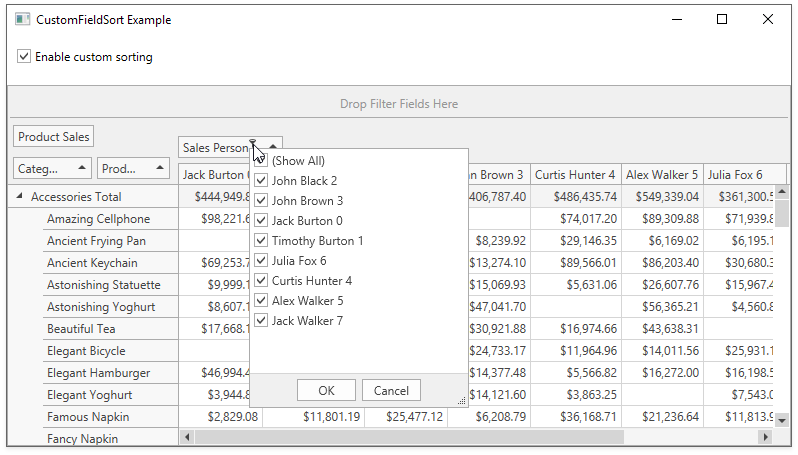

<!-- default badges list -->

<!-- default badges end -->
# How to Use the CustomFieldSort Event and a Hidden Field to Sort the Visible Field

This example demonstrates how to sort the _Sales Person_ field values:

* in the PivotGridControl by the hidden data field (_SalesPersonId_)
* in the [Filter Drop-Down](https://docs.devexpress.com/WPF/10932) by the person's last name 

Check the _Enable custom sorting_ box to apply custom sorting algorithm  instead of the default alphabetical sorting order. In the picture below the _SalesPersonId_ value is appended to the name displayed in the _Sales Person_ field for better visibility.

The checked _Enable custom sorting_ box switches the [PivotGridField.SortMode](https://docs.devexpress.com/WPF/DevExpress.Xpf.PivotGrid.PivotGridField.SortMode) property to the [FieldSortMode.Custom](https://docs.devexpress.com/WPF/DevExpress.Xpf.PivotGrid.FieldSortMode) value. This setting instructs the PivotGridControl to fire the [PivotGridControl.CustomFieldSort](https://docs.devexpress.com/WPF/DevExpress.Xpf.PivotGrid.PivotGridControl.CustomFieldSort) event for that field.

The CustomFieldSort handler uses the [e.SortLocation](https://docs.devexpress.com/WPF/DevExpress.Xpf.PivotGrid.PivotCustomFieldSortEventArgs.SortLocation) property to determine whether the field values are displayed in the pivot grid, or in the filter popup. 

If the field is displayed in the pivot grid, the code compares values obtained from the _SalesPersonId_ column and assigns the result to the [e.Result](https://docs.devexpress.com/WPF/DevExpress.Xpf.PivotGrid.PivotCustomFieldSortEventArgs.Result) property.

If the field is displayed in the filter popup, the _e.ListSourceRowIndex1_ and _e.ListSourceRowIndex2_ properties are always -1 and cannot be used to determine the underlying data row. In this situation, the comparison algorithm processes the field value itself.

API in this example:

* [PivotGridField.SortMode](https://docs.devexpress.com/WPF/DevExpress.Xpf.PivotGrid.PivotGridField.SortMode) property
* [FieldSortMode](https://docs.devexpress.com/WPF/DevExpress.Xpf.PivotGrid.FieldSortMode) enumeration
* [PivotGridControl.CustomFieldSort](https://docs.devexpress.com/WPF/DevExpress.Xpf.PivotGrid.PivotGridControl.CustomFieldSort) event
* [PivotGridCustomFieldSortEventArgs](https://docs.devexpress.com/WPF/DevExpress.Xpf.PivotGrid.PivotCustomFieldSortEventArgs) object

**See also:**

* [Sorting](https://docs.devexpress.com/WPF/8009)

